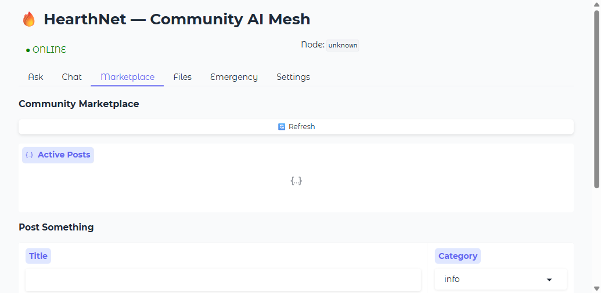
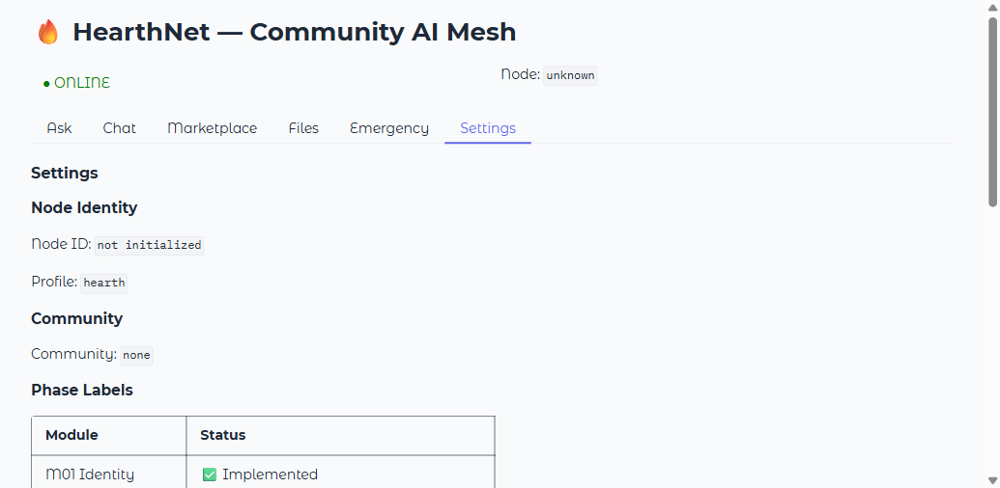

---
title: HearthNet
emoji: 🔥
colorFrom: purple
colorTo: pink
sdk: gradio
sdk_version: 6.17.3
python_version: "3.13"
app_file: app.py
pinned: true
short_description: Community-Owned AI That Works Even When The Internet Doesn't
---

# 🔥 HearthNet

### Community-Owned AI That Works Even When The Internet Doesn't

<p align="center">
  <strong>Local-First AI &nbsp;•&nbsp; Community-Powered &nbsp;•&nbsp; Resilient by Design &nbsp;•&nbsp; Offline-Capable</strong>
</p>

---

## What is HearthNet?

HearthNet transforms the computers already in your community into a **resilient, fully local AI network**.

- No centralized cloud required
- No single point of failure
- Works during internet outages, censorship, or infrastructure failures
- Real local AI inference via Ollama, llama.cpp, or Hugging Face Transformers

---

## Screenshots

### Ask (LLM chat with local AI)


### Local Chat


### Community Marketplace



### Emergency / Connectivity Status


### Settings & Identity



---

## Quick Start

```bash
# Clone
git clone https://huggingface.co/spaces/build-small-hackathon/HearthNet
cd HearthNet

# Install (editable — PyPI package coming soon)
pip install -e ".[dev]"

# Run Gradio UI
python app.py
# open http://127.0.0.1:7860
```

### With a local LLM (Ollama)

```bash
# Install Ollama: https://ollama.com
ollama pull llama3.2:3b

# Start HearthNet — it will auto-detect Ollama
python app.py
```

### CLI

```bash
python -m hearthnet.cli --help
python -m hearthnet.cli node info
python -m hearthnet.cli ask "What is HearthNet?"

# List models available on this node (BitTorrent M26)
python -m hearthnet.cli call model.list 1 0 '{}'

# Route a query to best expert (MoE M27)
python -m hearthnet.cli call moe.route 1 0 '{"query":"emergency first aid"}'
```

---

## Architecture

```
+----------------------------------------------------------+
|  Gradio UI (app.py)  .  FastAPI Transport (X01)          |
+-----------------------------+----------------------------+
                              | Capability Bus (M03)
          +-------------------+-------------------+
          v                   v                   v
   +--------------+  +-------------+  +-----------------------+
   |  LLM (M04)   |  |  RAG (M05)  |  |  Group Chat (M25)     |
   |  Ollama      |  |  Chroma     |  |  ThreadService        |
   |  llama.cpp   |  |  Embed      |  |  ThreadViewStore      |
   |  HF Transfm  |  |  Ingest     |  +-----------------------+
   +--------------+  +-------------+
          v                   v
   +--------------+  +------------------------------------------+
   |  Identity    |  |  Phase 2 Services                        |
   |  Ed25519     |  |  OCR (M17) . Translation (M18)           |
   |  X3DH        |  |  STT/TTS (M19) . Vision (M20)            |
   |  Ratchet     |  |  Tool Calls (M21) . Mobile (M22)         |
   |  Tokens      |  |  E2E Encrypt (M23) . Rerank (M24)        |
   +--------------+  +------------------------------------------+
                              |
   +--------------------------+-------------------+
   v                          v                   v
+----------+  +-------------------+  +--------------------+
|  DHT/P2P |  |  Federation (M14) |  |  Observability (X03)|
|  Kademlia|  |  Relay Tier (M15) |  |  Metrics . Tracing  |
|  WebSocket  |  federated metrics|  |  JSON logging       |
+----------+  +-------------------+  +--------------------+
```

---

## Module Reference

### Phase 1 — Core Infrastructure

| Module | Description | Status |
|--------|-------------|--------|
| M01 | Node identity (Ed25519, manifests, canonical JSON) | done |
| M02 | Peer discovery (mDNS, UDP broadcast, PeerRegistry) | done |
| M03 | Capability bus (schema validation, routing, tracing) | done |
| M04 | LLM service (Ollama, llama.cpp, HF Transformers, OpenAI fallback) | done |
| M05 | RAG / knowledge (chunker, ChromaDB, IngestPipeline) | done |
| M06 | Marketplace (event-sourced, local-first) | done |
| M07 | File blobs (BLAKE3 hash, chunking, FileService, model.* distribution) | done |
| M08 | Gradio UI (8 tabs: Ask, Chat, Mesh, Marketplace, Files, Emergency, Settings, Getting Started) | done |
| M09 | Emergency mode (async connectivity probe loop) | done |
| M10 | Chat (event-backed 1:1 messaging) | done |
| M11 | Embeddings (embed.text, SimpleHashBackend) | done |
| M12 | CLI (click, ask / node info / marketplace) | done |
| M13 | Onboarding (invite QR, hnvite:// deep links) | done |
| X01 | Transport (FastAPI server, 12 REST endpoints) | done |
| X02 | Events (SQLite, Lamport clocks, ReplayEngine) | done |
| X03 | Observability (structured JSON logging, metrics, tracing) | done |
| X04 | Config (typed frozen Config, TOML, env overlay) | done |

### Phase 2 — Advanced Features

| Module | Description | Status |
|--------|-------------|--------|
| M14 | Federation (bilateral cross-community trust, manifest signing) | done |
| M15 | Relay tier (NAT traversal, keepalive, push token registry) | done |
| M16 | Capability tokens (Ed25519 JWS-style hntoken://v1/ format) | done |
| M17 | OCR (Tesseract + TrOCR backends, graceful degradation) | done |
| M18 | Translation (NLLB backend, LRU cache, 4000-char limit) | done |
| M19 | STT/TTS (Whisper local STT, Edge TTS synthesis) | done |
| M20 | Vision (Florence-2 image describe, generate placeholder) | done |
| M21 | Tool calls (LLM mid-generation bus dispatch, ToolExecutor, plant_identify) | done |
| M22 | Mobile native (Flutter contract, hnapp:// invites, push authority) | done |
| M23 | E2E encryption (X3DH key agreement, Double Ratchet, envelope) | done |
| M24 | Reranking (BGE + CrossEncoder backends, 100-doc limit) | done |
| M25 | Group chat (ThreadService, ThreadViewStore, event-sourced) | done |
| X05 | DHT (Kademlia node, 256-bucket routing table, bootstrap) | done |
| X06 | WebSocket upgrade (bidirectional pubsub, WsClient) | done |
| X07 | Federated metrics (NodeMetricsTick, MetricsAggregator, OTLP) | done |

### Phase 3 — Research / Experimental

All Phase 3 modules are feature-flag gated (config.research.*).
They are experimental and not enabled by default.

| Module | Description | Status |
|--------|-------------|--------|
| M26 | Distributed inference (ShardDescriptor, PipelineOrchestrator, model.pull/model.list) | **registered** |
| M27 | MoE routing (ExpertRegistry, MoeRouter, moe.route/moe.register/moe.list) | **registered** |
| M28 | Federated learning (FedLearnCoordinator, RoundManifest) | experimental |
| M29 | LoRa beacons (32-byte frames, long-range low-bandwidth signaling) | experimental |
| M30 | Evidence graph / EBKH (ClaimStore, attestations, disputes) | experimental |
| M31 | Civil defense NRW (AuditChain, role certs, structured alerts) | experimental |

---

## Local-First AI Backends

HearthNet uses **real local models** — no mocks, no fake responses.

Priority order:

1. **Ollama** (preferred — zero-config, 70+ models)
2. **llama.cpp** HTTP server
3. **Hugging Face Transformers** (local model files)
4. **OpenAI API** — opt-in online fallback only, never the default

If no backend is reachable the service returns `{"status": "unavailable"}` and the UI shows a clear degraded state message.

---

## Security

- Ed25519 signatures on all node manifests and capability tokens
- X3DH key agreement + Double Ratchet for end-to-end encrypted chat
- BLAKE3 content-addressed file blobs
- All CLI HTTP requests restricted to localhost only
- Emergency probes use TLS verification (verify=True)
- Bandit HIGH findings: 0

---

## Quality Gates

```bash
# Lint
ruff check hearthnet/ tests/

# Type check
mypy hearthnet/

# Security scan
bandit -r hearthnet/ -ll

# Unit + integration tests (102 passed, 0 failed)
python -m pytest tests/ -q

# E2E browser tests (Playwright)
python -m pytest tests/test_e2e_user_stories.py -v
```

---

## Test Coverage

| Suite | Tests | Notes |
|-------|-------|-------|
| Phase 1 (M01-M13, X01-X04) | 13 | Core bus, routing, emergency, snapshot |
| Phase 2 (M14-M25, X05-X07) | 23 | Crypto, tokens, federation, OCR, chat, DHT |
| Phase 3 experimental | 15 | Distributed inference, MoE, fedlearn, LoRa, evidence, civdef |
| Real-service integration | 18 | RAG, LLM routing, cross-node bus, marketplace, FileService |
| E2E Playwright browser | 21 | All 8 tabs, API health, mobile viewport (skipped without server) |
| **Total** | **102 passed, 0 failed** | Python 3.13 + pytest-asyncio 0.26 |

---

## Contributing

See [tasks.md](tasks.md) for current status, known gaps, and next steps.

Architecture decisions are documented in the `docs/` folder:

- [docs/00-OVERVIEW.md](docs/00-OVERVIEW.md) — system overview
- [docs/CAPABILITY_CONTRACT.md](docs/CAPABILITY_CONTRACT.md) — capability API contract
- [docs/GLOSSARY.md](docs/GLOSSARY.md) — terminology
- [docs/roadmap.md](docs/roadmap.md) — roadmap
- [docs/p2_p3/](docs/p2_p3/) — Phase 2 and 3 specs

---

<p align="center">
  Built with open source models and the belief that communities should own their AI.
</p>
